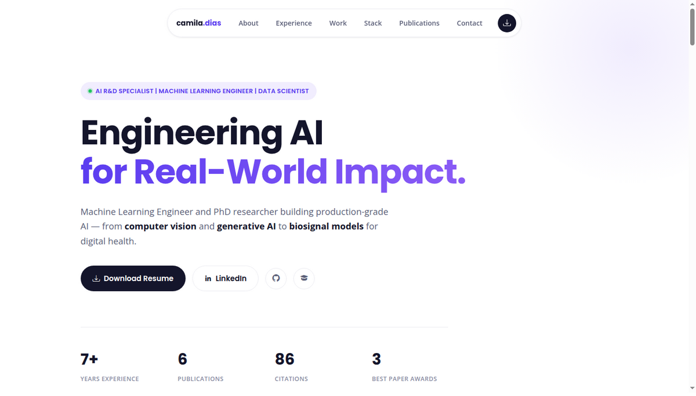

<div align="center">

# camila.dias

### Machine Learning Engineer · Data Scientist · AI R&D Specialist

**[cmdiasbr.github.io](https://cmdiasbr.github.io)**


<br>



</div>

---

## About

This is the source for my personal portfolio — a single-page site built to give recruiters, collaborators and fellow researchers a fast, honest snapshot of what I do: production ML systems, applied computer vision, generative AI, and academic research in medical AI.

No framework, no build step. Just clean HTML, CSS and a sprinkle of vanilla JS, deployed straight from this repo via GitHub Pages.

## ✨ What's on the page

| Section | What it shows |
|---|---|
| **Hero** | Current role, quick-glance stats (years of experience, publications, citations, awards) |
| **About** | Who I am, in a couple of honest paragraphs |
| **Experience** | A timeline across Samsung, Globo, ClearSale, PixForce and Compass UOL |
| **Work** | Case-study style cards for a few projects I'm proud of |
| **Stack** | The tools I actually use, grouped by category |
| **Education** | PhD, M.Sc., B.Sc. — with the awards that came with them |
| **Publications** | Real numbers pulled from [Lattes](http://lattes.cnpq.br/1548809558838460) and [Google Scholar](https://scholar.google.com.br/citations?hl=pt-BR&user=73dzoHUAAAAJ) — citations, venues, best-paper awards |
| **Contact** | Every way to reach me, in one place |

## 🛠 Built with

- **HTML5 / CSS3** — hand-written, no CSS framework (grid + flexbox layout, CSS variables for theming)
- **Vanilla JavaScript** — nav scrollspy, mobile menu, back-to-top, no dependencies
- **[AOS](https://michalsnik.github.io/aos/)** — scroll animations
- **[Boxicons](https://boxicons.com/) / [Bootstrap Icons](https://icons.getbootstrap.com/)** — iconography
- **GitHub Pages** — hosting, straight from `master`

## 📁 Structure

```
.
├── index.html                  # the entire site — one page, all sections
├── assets/
│   ├── css/clean.css           # design system: colors, type, layout
│   ├── js/clean.js             # nav, scrollspy, back-to-top
│   ├── img/                    # profile photo, publication thumbnails, favicons
│   ├── vendor/                 # AOS, Boxicons, Bootstrap Icons
│   └── CamilaDias-CV_EN.pdf    # downloadable résumé
├── forms/                      # contact form endpoint (unused on the live site)
└── docs/preview/                # README screenshot
```

## 🚀 Running locally

No build step, no dependencies to install — it's static HTML.

```bash
git clone https://github.com/cmdiasbr/cmdiasbr.github.io.git
cd cmdiasbr.github.io
python3 -m http.server 8080
# open http://localhost:8080
```

## 📬 Get in touch

[](https://www.linkedin.com/in/camilalvesdias/)
[](https://github.com/cmdiasbr)
[](https://scholar.google.com.br/citations?hl=pt-BR&user=73dzoHUAAAAJ)
[](mailto:cmdias@outlook.com.br)

---

<sub>Originally scaffolded from the free [MyResume](https://bootstrapmade.com/free-html-bootstrap-template-my-resume/) template by BootstrapMade — the layout, styling and content have since been fully rebuilt.</sub>
